# Větrací mřížka s žaluzií ovládanou táhlem zespodu

Plastová větrací mřížka **180 × 250 mm** s nastavitelnou žaluzií, podobná
typu *Dalap GP 180×250 s mechanicky ovládanou žaluzií*. Rozdíl je v ovládání:
místo páčky na mřížce **visí ze spodku rámu tyčka s rukojetí**, takže
mřížku ve výšce ovládne i menší člověk ze země.
Tyčka je při pohledu zepředu **vlevo**. Na pravou stranu ji přepne parametr
`ovladani = "vpravo"`.

- **zatlačit tyčku nahoru → otevřeno**
- **stáhnout tyčku dolů → zavřeno**
- pružná západka drží tři polohy: **zavřeno / napůl / otevřeno**
- vzadu je **pevný rošt** a za ním **síťka proti hmyzu**, kupovaná nebo tištěná
- mřížka má dvě části: **montážní deska** zůstává na zdi, **přední kryt**
  s lamelami se sundá po pootočení 4 tištěných zámků, třeba kvůli výměně síťky

Model je parametrický (OpenSCAD) a všechny díly se tisknou **bez podpěr**.

| Otevřeno | Zavřeno | Mechanismus (boční řez) |
|---|---|---|
| 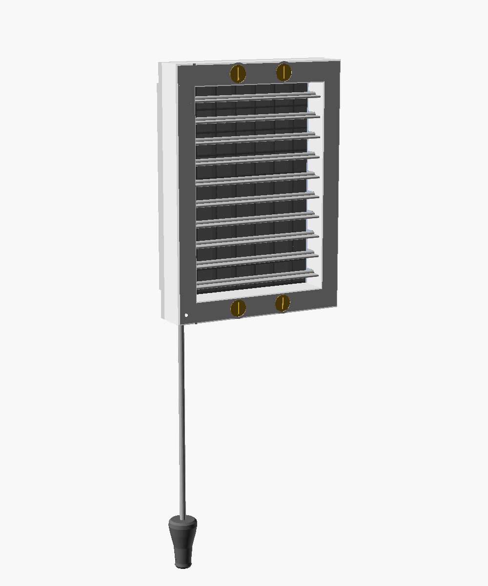 | 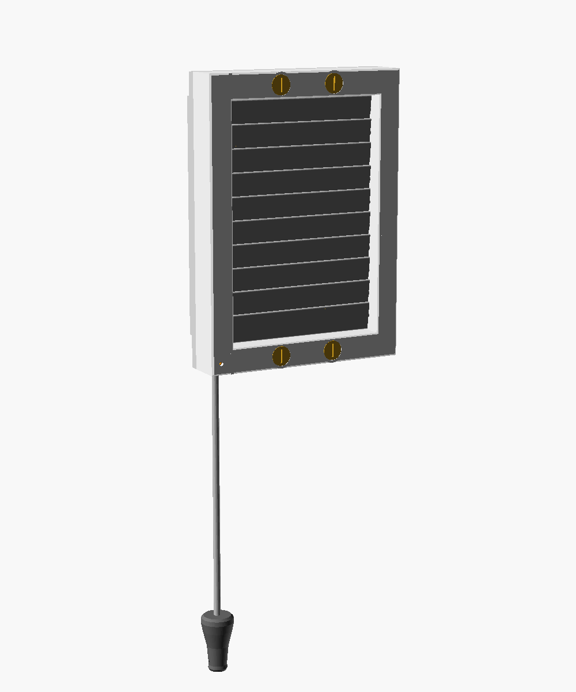 | 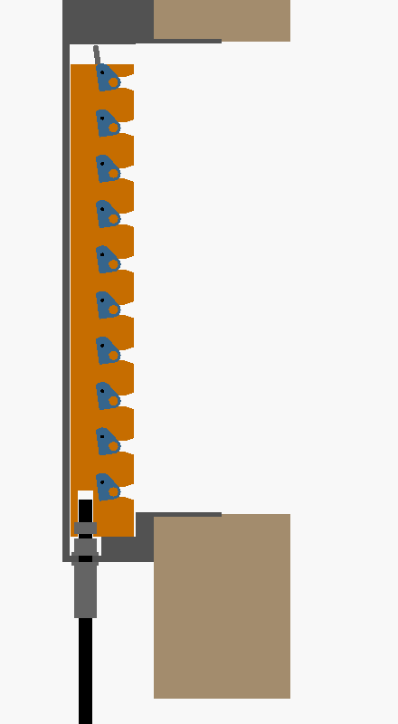 |

## Jak to funguje

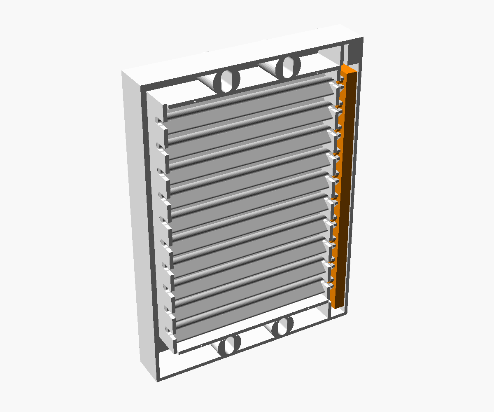

1. Deset vodorovných lamel se otáčí na čepech v rámu.
2. Na konci u táhla má každá lamela **vidlicové rameno**. Rameno je schované
   v boční komoře rámu, zepředu ho není vidět.
3. V komoře jezdí svislá **ovládací lišta** (oranžová). Její čepy zapadají
   do vidlic všech lamel najednou.
4. Lišta se pohybuje jen nahoru a dolů, **zdvih je 13 mm**. Lamely se přitom
   otočí o 82° z vodorovné polohy do téměř svislé a zavřené lamely se
   překrývají.
5. Do spodku lišty se prostrčí dnem rámu **tyčka Ø 6 mm**. Drží ji stavěcí
   šroubek, který se utahuje malým otvorem v líci rámu.
6. Na přední straně lišty je **pružný jazýček s výstupkem**, který zapadá do
   drážek v čele rámu. Díky tomu lamely drží v nastavené poloze a tyčka
   nesjede vlastní vahou.
7. Krajní polohy mají pevné dorazy: dole dosedne lišta na dno rámu, nahoře
   narazí na doraz v komoře.

Rozložená sestava:

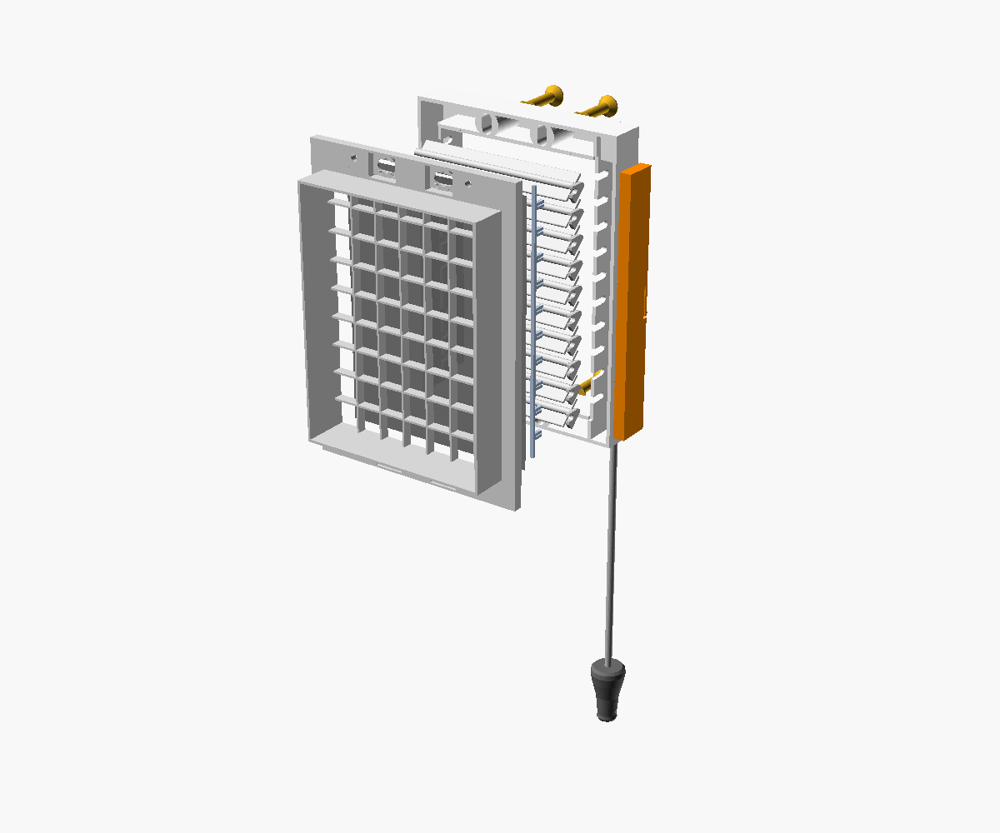

## Rozměry (výchozí nastavení)

| | |
|---|---|
| vnější rozměr rámu | 180 × 250 mm |
| vystoupení ze zdi | 40 mm (přední kryt 32 + montážní deska 8) |
| světlý průduch (lamely) | 140 × 206 mm |
| otvor ve zdi (zadaný) | 158 × 208 mm |
| límec do otvoru ve zdi | 156 × 206 mm (vůle 1 mm na stranu), **stěny 2 mm**, hloubka 30 mm |
| rošt v montážní desce | 152 × 202 mm, oka cca 22 × 22 mm, žebra 1,6 mm |
| síťka proti hmyzu | přes celý otvor v límci, ustřihnout na **159 × 211 mm** |
| lamely | 10 ks, rozteč 20 mm, šířka 25 mm |
| zdvih táhla | 13 mm |
| osa tyčky | vlevo, 8 mm od levého okraje a 28 mm od zdi |
| vruty do zdi | 4× Fischer DuoPower 8 × 65 S jen skrz montážní desku, rozteč 100 mm vodorovně a 234 mm svisle, osa 8 mm od horní/dolní hrany (13 mm od otvoru ve zdi) |
| přední kryt k montážní desce | 4 otočné zámky na čtvrt otáčky: šroubovitý náběh, půlkruhová aretace, dorazy; rozteč 50 mm |

> **Otvor ve zdi** je nastavený na 158 × 208 mm (`otvor_sirka`,
> `otvor_vyska`). Límec se podle něj spočítá sám, o 1 mm na každou stranu
> menší (`limec_vule`).

## Díly k tisku

Hotová STL jsou ve složce [`stl/`](stl). Jsou už natočená do tiskové polohy.

| Díl | Soubor | Ks | Poznámka k tisku |
|---|---|---|---|
| Přední kryt (rám) | `ram.stl` | 1 | lícem dolů, potřebuje podložku aspoň **180 × 250 mm** |
| Montážní deska s límcem a roštem | `zadni_deska.stl` | 1 | deskou dolů; pro kupovanou síťku |
| *nebo* montážní deska s tištěnou síťkou | `zadni_deska_se_sitkou.stl` | 1 | místo předchozí; deskou dolů, viz [Síťka proti hmyzu](#síťka-proti-hmyzu) |
| Lamela | `lamela.stl` | **10** | rovnou stranou dolů, rameno nahoru |
| Ovládací lišta | `lista.stl` | 1 | čepy nahoru, délka 214 mm |
| Pojistný hřebínek | `pojistka.stl` | **2** | naležato |
| Rukojeť | `rukojet.stl` | 1 | otvorem nahoru |
| Vodítko tyčky na zeď | `voditko.stl` | 0–2 | volitelné, když se tyčka moc houpe |
| Spojka tyčí | `spojka.stl` | 0–1 | volitelné, pro spojení dvou tyček |
| Otočný klíč zámku | `klic.stl` | **4** | nastojato na rovné straně příčky, hlavou nahoru, bez podpěr; 4 perimetry, výplň 100 % |

**Materiál:** PETG (do interiéru) nebo ASA (na přímé slunce, originál je
také z ASA). PLA nedoporučuji, protože pružná západka z PLA časem povolí
nebo praskne.
**Nastavení:** vrstva 0,2 mm, 3 perimetry, výplň 20 %, **bez podpěr**.
Lištu tiskněte se 4 perimetry, protože západka a čepy jsou namáhané nejvíc.

## Co koupit

| Položka | Ks | Kde koupit (příklady) |
|---|---|---|
| Hmoždinka **Fischer DuoPower 8 × 65 S** (balení obsahuje zápustné vruty **5 × 80**) | 4 | [KUTIL.cz](https://www.kutil.cz/spojovaci-material-a-kotevni-technika/kotevni-technika/vseobecne-hmozdinky/hmozdinka-duopower-fischer-8x65-1/), [srovnání cen na Heureka](https://www.heureka.cz/?h%5Bfraze%5D=hmo%C5%BEdinka+duopower+fischer+8x65), [technický list Fischer](https://www.fischer-cz.cz/cs-cz/products/bezne-hmozdinky/plastove-hmozdinky/duopower/538256-duopower-8x65-s) |
| Tyčka **Ø 6 mm**: hliníková kulatina (plná), délka dle výšky (viz níže) | 1 | [KUTIL.cz – tyč kruhová hliník 6 mm](https://www.kutil.cz/zelezarstvi/hutni-material/hlinikovy/tyc-kruhova-hlinik-6mm/), [ATREON – hliníková kulatina 6 mm](https://www.atreon.cz/hlinikova-kulatina-6-mm-en-6060/), [HORNBACH – trubka Ø 6 mm, 1 m](https://www.hornbach.cz/p/kulata-trubka-hlinikova-stribrna-o-6-mm-1m/6069570/) |
| Stavěcí šroub (červík) **M3 × 5**, DIN 913 / ISO 4026, imbus | 1 + 1 do rukojeti (+2 do spojky) | [PeckaModel – šrouby a červíky na imbus](https://www.peckamodel.cz/produkty/rc-modely-a-prislusenstvi/prislusenstvi/spojovaci-material/srouby-cerviky-imbus), [ATILASHOP – stavěcí šrouby](https://www.atilashop.cz/staveci-srouby-cerviky/), [KUTIL.cz – DIN 913](https://www.kutil.cz/spojovaci-material-a-kotevni-technika/srouby/imbus-vnitrni-sestihran/sroub-staveci-plochy-konec-imbus-din-913/) |
| Síť proti hmyzu, sklolaminátová, metráž (stačí kus 16 × 22 cm) | 1 | [UNI HOBBY – metráž šedá](https://unihobby.cz/sit-proti-hmyzu-sklovlaknita-metraz-seda), [BAUHAUS – sítě proti hmyzu](https://www.bauhaus.cz/site-proti-hmyzu-245270), [OBI – sítě proti hmyzu](https://www.obi.cz/ochrana-proti-hmyzu/ochranne-site-proti-hmyzu/c/2200), [Onpira – metráž](https://www.onpira.cz/zbozi/site-proti-hmyzu-skelne-vlakno/) |
| Imbusový klíč **1,5 mm** (na červíky) | 1 | [UNI HOBBY](https://www.unihobby.cz/imbus-klic-1-5mm-cv), [PeckaModel](https://www.peckamodel.cz/600900-klic-imbus-1-5mm), [Kavon (dlouhý)](https://www.kavon.cz/e-shop/wi-06059-49656/) |
| Vodítko (volitelné): 2 vruty 3,5 × 30 mm a hmoždinky 5 mm | 2 | [Heureka – hmoždinka 5 mm s vrutem](https://www.heureka.cz/?h%5Bfraze%5D=hmo%C5%BEdinka+5+mm+s+vrutem) |

> **Červík musí být M3 × 5 (nebo kratší), ne delší.** V liště je pro něj přesně
> 5,6 mm místa. Delší červík by vyčníval a drhl o čelo rámu.

### Délka tyčky

```
délka tyčky ≈ (výška spodní hrany mřížky) − (výška, kde má být rukojeť) + 25 mm
```

Příklad: mřížka má spodek ve 240 cm a rukojeť má být ve 170 cm, tedy tyčka
72,5 cm. Rukojeť je v dosahu v obou polohách, protože zdvih je jen 13 mm.

## Sestavení předního krytu

1. **Očistěte díly.** Lamela se musí v drážkách „U“ rámu otáčet volně. Když
   drhne, přejeďte čepy smirkem. Otvor v liště převrtejte vrtákem Ø 6 mm.
2. Rám položte **lícem dolů** na stůl. Komora mechanismu je teď při pohledu
   zezadu **vpravo**.
3. **Vložte lištu** do komory. Čepy musí směřovat k lamelám, výstupek
   západky ke stolu (k líci). Posuňte ji do **střední polohy**, kde cvakne
   prostřední drážka.
4. **Vkládejte lamely** jednu po druhé. Každou natočte tak, aby **otevřená
   vidlice ramene mířila kolmo od stolu**, a spusťte ji dolů. Čepy lamely
   zapadnou do drážek „U“ a vidlice nasedne na čep lišty. Všechny lamely
   budou pootevřené pod stejným úhlem.
5. **Zatlačte oba pojistné hřebínky** do vybrání na horní hraně přepážek,
   až **cvaknou**. Jejich prsty zajistí čepy lamel v drážkách. Každý prst je
   rozdělený na dvě pružné poloviny s výstupky, které zapadnou do drážek ve
   stěnách krytu, takže hřebínek drží i v sundaném krytu. Vytáhnout se dá
   silou (výstupky mají šikmé boky). Sílu západky mění `hrebinek_zapadka`.

   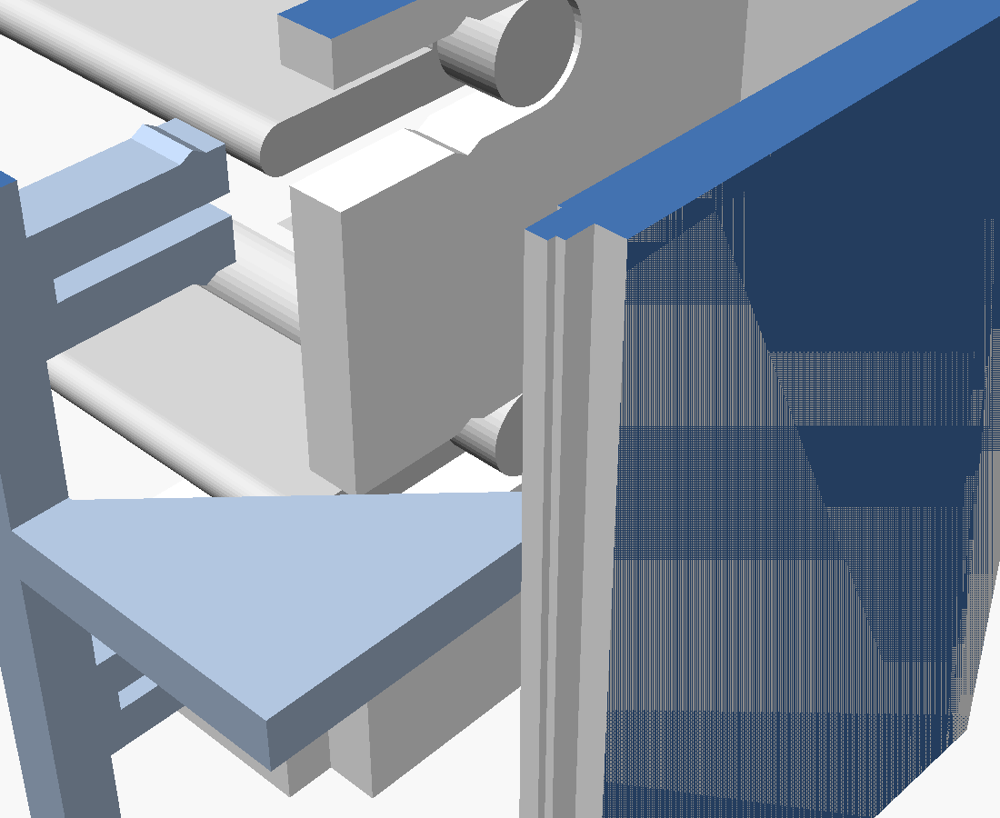

   *Hřebínek (modrý) vytažený z krytu: každý prst je rozdělený na dvě pružné
   poloviny s výstupky, ve stěnách drážek „U“ v krytu jsou proti nim drážky.*
6. **Vyzkoušejte chod:** prstem nebo kouskem tyčky zatlačte lištu otvorem ve
   dně nahoru a dolů. Lamely se musí otáčet všechny současně a západka musí
   cvakat ve třech polohách.
7. **Klíče zámků** (bez lepidla a bez šroubů): každý klíč zasuňte zepředu do
   otvoru v líci krytu se zářezem **svisle** (příčka projde svislou štěrbinou
   v krytu, hlava zapadne do zápustného lůžka) a pak ho otočte zářezem
   **vodorovně**. Příčka je teď za krytem napříč štěrbiny, takže klíč
   z krytu nevypadne.

## Zámek krytu (jak funguje)

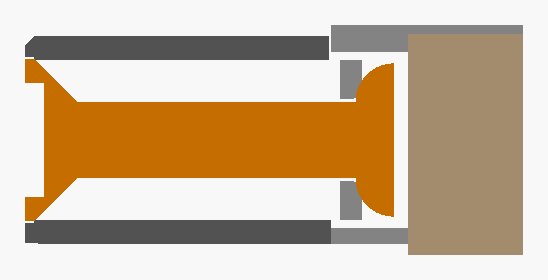

*Řez osou zámku: vlevo zápustná hlava klíče v líci krytu, kulatý dřík skrz kryt,
vpravo půlkulatá příčka za pružnými pásky montážní desky, úplně vpravo zeď.*

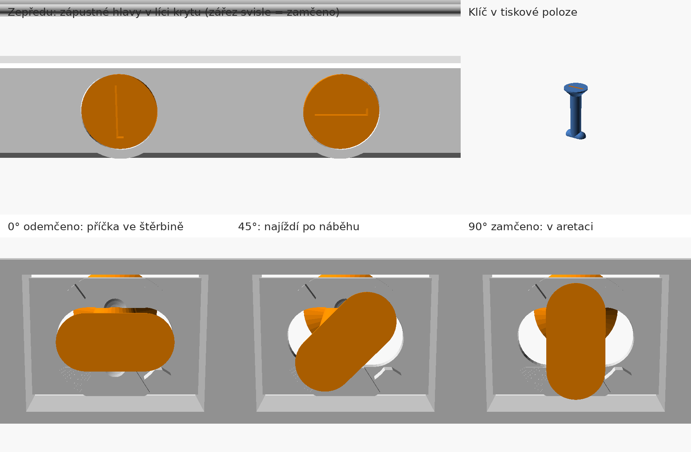

*Nahoře zepředu: hlavy klíčů (Ø 17 mm) jsou zapuštěné a zarovnané s lícem
krytu a otáčejí se v kuželovém lůžku; zářez svisle = zamčeno, vodorovně =
odemčeno. Vpravo klíč v tiskové poloze. Dole pohled od zdi do montážní
desky: příčka se otáčí v dutině montážní desky za krytem, v krytu je jen
kulatý dřík. Svislou štěrbinu pro první zasunutí klíče hlava zakryje
v každé poloze.*

Zámek je udělaný jako současné vačkové zámky na čtvrt otáčky (např. u
rozvaděčů): příčka po **šroubovitém náběhu** postupně přitáhne kryt, na konci
zapadne do **aretace** a **doraz** nedovolí přetočení. Všechny tvary, které
se o sebe opírají, jsou **zaoblené (půlkulaté)**: nemají ostré hrany, které
by soustředily napětí a vyrývaly se do plastu.

- **Klíč:** zápustná kulatá hlava Ø 17 mm se zkosením 45° sedí v kuželovém
  lůžku v líci krytu, zarovnaná s lícem, a sama se vystředí. Kulatý dřík
  Ø 8 mm a **půlkulatá příčka** (Ø 8 mm, rovnou stranou ke zdi, zaoblené
  konce). Tiskne se nastojato na rovné straně příčky, hlavou nahoru, bez
  podpěr. Průřez dříku Ø 8 mm unese v tahu i napříč vrstvami řádově přes
  1000 N, zámek přitom nese jen desítky N.
- **Náběh:** za vodorovnou štěrbinou v montážní desce jsou dva pružné pásky
  (1,5 mm, tištěné naplocho) se šroubovitým náběhem se sklonem asi 7°.
  Příčka po něm najíždí, pásky se prohnou až o 0,65 mm a kryt se přitáhne.
- **Aretace:** v zamčené poloze příčka zapadne do půlkruhového lůžka
  vytvarovaného přesně podle ní a zámek **cvakne**. Pásky zůstanou
  prohnuté o 0,3 mm, to je stálý přítlak krytu. Aby se zámek povolil, musí
  příčka vyjet zpátky přes vrchol náběhu, takže se sám neotevře.
- **Dorazy:** klíč se točí jen jedním směrem a jen o čtvrt otáčky.
- **Pojistka proti vypadnutí:** štěrbina v krytu je svislá, v desce
  vodorovná.
- **Ovládání:** mincí nebo plochým šroubovákem; zářez **svisle = zamčeno**,
  **vodorovně = odemčeno**.

Když jde zámek moc ztuha, zmenšete `klic_predpeti` (např. 0,2) nebo
`pruzina_tl`; když kryt drží volně, zvětšete `klic_predpeti` na 0,4.

## Montáž na zeď (Fischer DuoPower 8 × 65 S)

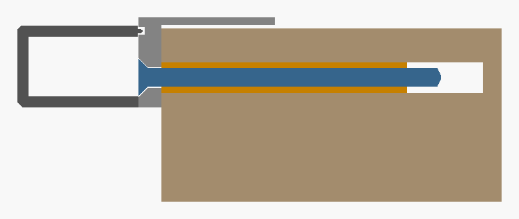

Na zeď se přišroubuje jen **montážní deska** (8 mm). Zápustné hlavy vrutů
5 × 80 jsou v rovině jejího čela, takže je přední kryt zcela zakryje. Vrut
jde do hmoždinky 72 mm (Fischer předepisuje aspoň 70 mm).

1. Montážní desku zasuňte límcem do otvoru ve zdi a srovnejte do vodováhy.
   Skrz 4 otvory označte místa pro hmoždinky a desku sundejte.
2. Vyvrtejte díry **Ø 8 mm, hloubka aspoň 85 mm**. Do cihly a porobetonu
   vrtejte bez příklepu. Vyfoukejte prach.
3. Hmoždinky zatlučte **do roviny zdi**.
4. Montážní desku přišroubujte vruty 5 × 80. Hlavy musí zapadnout do
   zahloubení v rovině čela desky.
5. **Síťka:** kupovanou síťku 159 × 211 mm nabodněte na 4 malé trny na zadní
   straně předního krytu (u horního a dolního okraje průduchu). Trny ji
   drží, takže při nasazování nespadne. (U montážní desky s tištěnou síťkou
   tento krok odpadá.)
6. **Nasaďte přední kryt** na montážní desku. Všechny 4 klíče musí mít
   zářez **vodorovně** (odemčeno), aby příčky prošly štěrbinami v desce.
   Kryt přitlačte k desce a každý klíč otočte mincí nebo šroubovákem
   o **čtvrt otáčky**, až je zářez **svisle** a zámek cvakne.
7. **Táhlo:** stáhněte lištu úplně dolů (zavřeno). Zespodu zasuňte tyčku
   otvorem ve dně až na doraz do lišty (18 mm). Klíčem 1,5 mm utáhněte
   červík **malým otvorem v líci rámu vlevo dole**.
8. Na spodní konec tyčky nasaďte **rukojeť** a zajistěte ji druhým
   červíkem.
9. Pokud se tyčka houpe, přišroubujte doprostřed její délky **vodítko**.
   Tyčka se do něj dá zacvaknout i dodatečně.

> ⚠️ **Vzdálenost od okraje otvoru ve zdi.** Otvor 208 mm je vysoký, nad ním
> i pod ním zbývá v mřížce 250 mm jen 21 mm. Vruty jsou proto co nejblíž
> vnější hraně desky (osa 8 mm od hrany, dál to nejde kvůli hlavě vrutu):
> osa hmoždinky je 13 mm od otvoru a mezi vývrtem Ø 8 a otvorem zbývá
> **asi 9 mm zdiva**. Vrtejte bez příklepu a vruty utahujte citlivě.
> Minimální vzdálenost od okraje pro váš materiál uvádí technický list
> Fischer. Víc místa dá jen vyšší mřížka (`vyska`), ta se ale nad 250 mm
> nevejde na běžné tiskové podložky. Model při změně parametrů vypíše,
> kolik zdiva zbývá.

## Síťka proti hmyzu

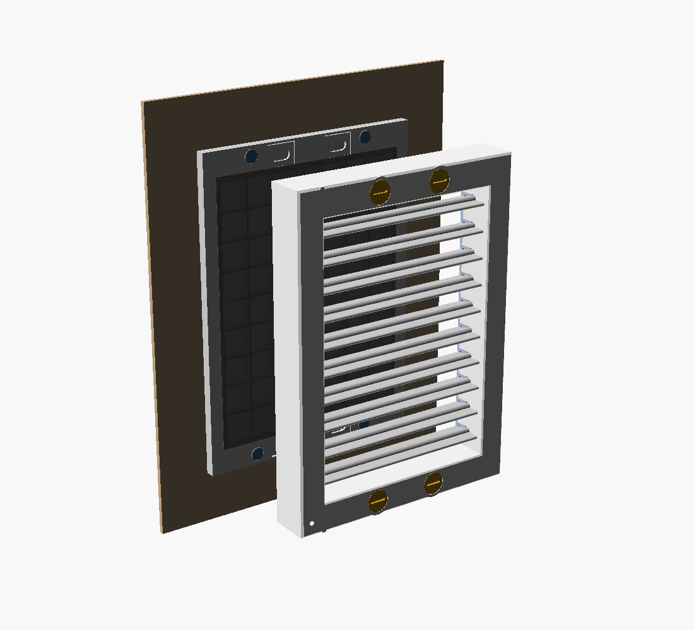

| Zezadu | Rozloženo (tištěná síťka) |
|---|---|
| 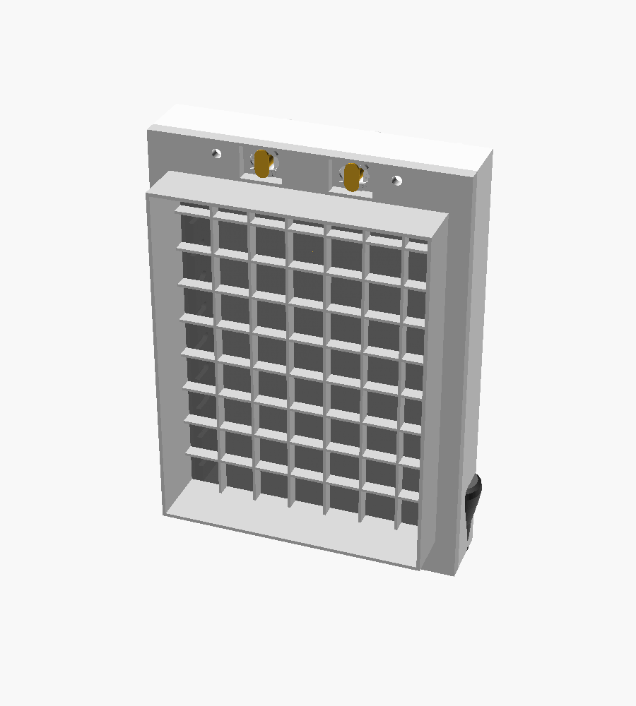 | 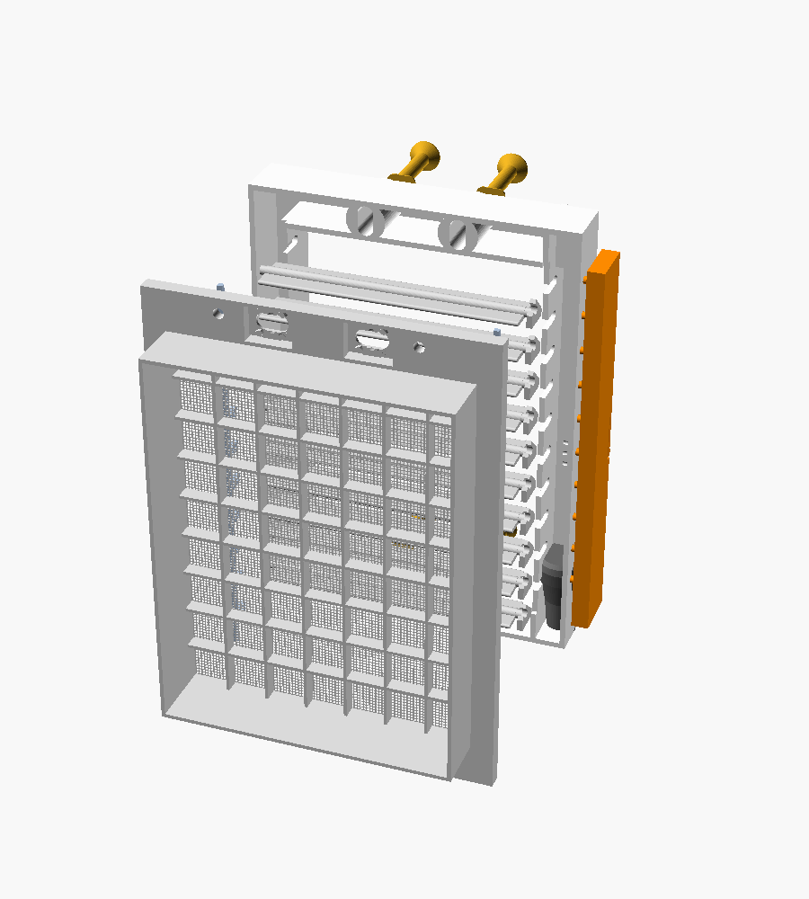 |

Síťka je **uprostřed mřížky, sevřená mezi předním krytem a montážní
deskou**. Drží ji po celém obvodu 4 otočné klíče, takže nemůže vypadnout ani
se po okraji vysunout. Hned za ní je **pevný rošt** v montážní desce, který
ji podepře a nepustí dovnitř ptáky. Před ní je 1,5 mm volného místa
k lamelám.

**Výměna nebo vyčištění síťky:** mincí otočte 4 klíče zářezem vodorovně
a přední kryt i s tyčkou sundejte. Montážní deska zůstane na zdi a síťka je
hned přístupná.

**Kupovaná síťka:** ze sklolaminátové sítě proti hmyzu ustřihněte obdélník
**159 × 211 mm** (pokryje celý otvor v límci). Přední kryt má pro síťku lůžko hluboké 0,25 mm, takže ji
montážní deska pevně stiskne.

**Tištěná síťka:** vytiskněte `zadni_deska_se_sitkou.stl` místo
`zadni_deska.stl`. Síťka je plochá mřížka v prvních dvou vrstvách montážní
desky: vlákna v obou směrech leží celou plochou na podložce, nic nevisí ve
vzduchu. Oka 1,2 × 1,2 mm, tloušťka 0,4 mm (dva průjezdy po 0,2 mm, lze
zvětšit parametrem `tistena_tl`). Tiskne se deskou dolů na čistou
podložku, výška vrstvy **0,2 mm**, šířka extruze 0,45–0,5 mm, bez
„ironing“. Pokud slicer vlákna vynechá, zvětšete `tistena_vlakno` na 0,6.
Rozteč lze změnit parametrem `tistena_roztec`.

Rošt ubere asi 12 % průřezu, síťka proti hmyzu dalších zhruba 30–40 %.
S tím je potřeba počítat, pokud je větrání na hraně.

## Úpravy modelu

Otevřete `mrizka.scad` v [OpenSCAD](https://openscad.org) (2021.01 nebo
novější). V panelu *Customizer* lze měnit hlavně:

- `ovladani`: strana táhla při pohledu zepředu (`vlevo` nebo `vpravo`)
- `sirka`, `vyska`: vnější rozměr rámu
- `pocet_lamel`, `roztec`, `sirka_lamely`: počet a velikost lamel.
  Světlý průduch a okraje se dopočítají samy.
- `otvor_sirka`, `otvor_vyska`: světlý otvor ve zdi; límec se spočítá sám
  (`limec_vule`), nebo ho zadejte ručně (`limec_sirka`, `limec_vyska`)
- `vrut_od_okraje`: vzdálenost vrutu od hrany desky (menší = dál od otvoru)
- `tl_desky`, `roztec_sroubu`, `hlava_sroubu`: montážní deska a vruty do
  zdi (výchozí hodnoty pro Fischer DuoPower 8 × 65 S s vrutem 5 × 80)
- `roztec_klicu`, `klic_predpeti`, `pruzina_tl`: zámky předního krytu
  (viz [Zámek krytu](#zámek-krytu-jak-funguje))
- `bok_protejsi`: šířka bočního okraje bez mechanismu (výchozí 20 mm = souměrný kryt)
- `hrebinek_zapadka`: výška výstupků západky pojistných hřebínků
- `sitka`: `kupovana`, `tistena` nebo `zadna`; `sitka_tl`: hloubka lůžka
  pro kupovanou síťku; `rost_roztec`, `rost_zebro`: pevný rošt;
  `tistena_roztec`, `tistena_vlakno`: tištěná síťka
- `prumer_tycky`: průměr tyčky, například 8 mm pro silnější kolík
- `pocet_poloh`: počet aretačních poloh (3 nebo 5)
- `dil`: co se vykreslí (sestava, řez, schéma, rozložený pohled nebo
  jednotlivé díly pro tisk)
- `otevreni`: poloha žaluzie v náhledu (0 až 1)

Model obsahuje kontroly (`assert`), které upozorní na nesmyslnou kombinaci
parametrů.

**Kontrola kolizí a přegenerování STL a obrázků:**

```bash
./skripty/export.sh                              # výchozí rozměry
./skripty/export.sh -D vyska=300 -D pocet_lamel=12   # vlastní rozměry
```

Skript nejdřív spustí `kontrola.scad`. Ta ve 41 polohách mezi zavřeno
a otevřeno ověří, že lamely nenarážejí do sebe ani do rámu, ramena nenarážejí
do komory a čepy lišty zůstávají ve vidlicích. Teprve potom skript
vygeneruje STL, obrázky a animaci.

## Ladění

- **Západka drží málo nebo moc:** výstupek na liště lze zabrousit, nebo
  změnit `r_bump`, `t_j` (tloušťka jazýčku) či `L_j` (délka jazýčku)
  v sekci *Hidden*.
- **Lamely drhnou:** zvětšete vůle, tedy `r_osa + 0.2` v drážkách „U“,
  nebo zabruste čepy.
- **Zavřené lamely nedoléhají:** úhel `uhel_zavreni` lze zvednout až k mezi,
  kterou hlídá `assert` (výchozí 82° nechává mezi lamelami 0,4 mm).

## ⚠️ Důležité upozornění

Pokud mřížka přivádí **spalovací vzduch pro plynový spotřebič** (kotel,
karma, sporák v bytě s komínovým spotřebičem), **nesmí být uzavíratelná**.
Plynárenská pravidla (TPG 704 01) uzavíratelné větrací otvory pro přívod
spalovacího vzduchu nepovolují. Tuto mřížku tam nepoužívejte. Hrozí otrava
oxidem uhelnatým.

## Alternativy ovládání

Kdyby tyčka překážela:

- **šňůrka se dvěma konci** (jako u rolet): vyžaduje kladku nahoře a vratnou
  pružinu, což je složitější a méně spolehlivé,
- **háček na tyči**, který se nosí zvlášť: do spodku lišty by se místo
  tyčky tiskl krátký kroužek.

Pevná tyčka je nejjednodušší a funguje oběma směry: tlačit i táhnout.
